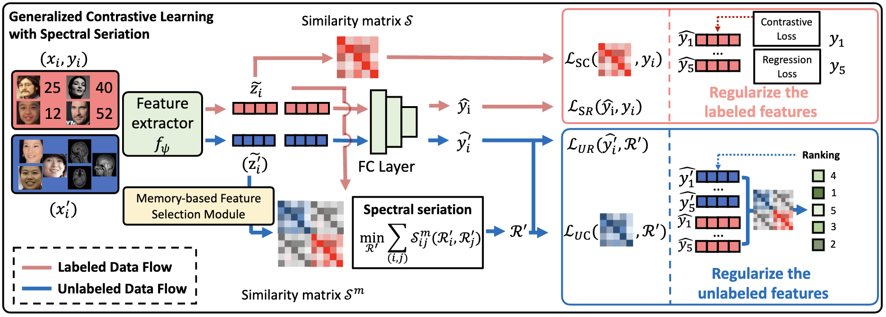

# Contrastive Learning for Semi-Supervised Deep Regression with Generalized Ordinal Rankings from Spectral Seriation


This is the official implementation of GCLSS (Generalized CLSS) and CLSS (NeurIPS 2023 ["Semi-Supervised Contrastive Learning for Deep Regression with Ordinal Rankings from Spectral Seriation"](https://openreview.net/forum?id=ij3svnPLzG)).



<br />
<br />


## Implementation on operator learning, age estimation, and brain-age estimation

Implementations for the three tasks are provided in the separate folders. 


## Datasets and pre-trained weights

Required files are shared at:
https://hkustconnect-my.sharepoint.com/:f:/g/personal/wdaiaj_connect_ust_hk/Eu_ZWAv3ZCNHvNl4U24F-7sBnr9Ur57IWtbBHTnyIOGmdQ?e=VRNVGb 

Links are also available in the folders for the individual tasks.


## Notes
* Contact: WANG Ce (wangc79@mail.sysu.edu.cn) and DAI Weihang (wdai03@gmail.com)
<br />
<br />

## Citation
If this code is useful for your research, please consider citing:


```
@inproceedings{dai2023semi,
  title={Semi-Supervised Contrastive Learning for Deep Regression with Ordinal Rankings from Spectral Seriation},
  author={Dai, Weihang and Yao, DU and Bai, Hanru and Cheng, Kwang-Ting and Li, Xiaomeng},
  booktitle={Thirty-seventh Conference on Neural Information Processing Systems},
  year={2023}
}

```
